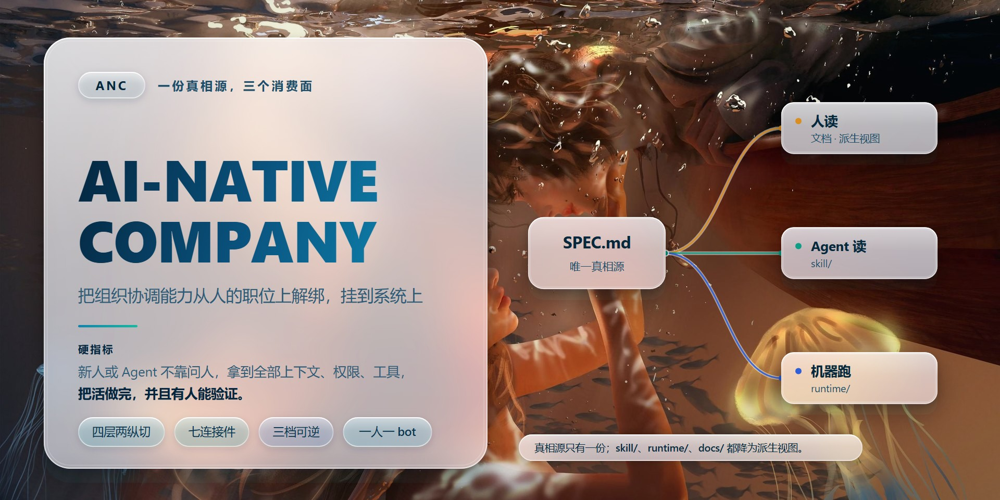

# ai-native-company



> **本仓库是 ANC 的载体。** 一份真相源，三个消费面。

## ANC 是什么

**ANC 把组织协调能力从人的职位上解绑、挂到系统上。** 0 中层是结果，提效是副产品。

判断它成不成，硬指标只有一句：**新人或 Agent 能不能不靠问人，拿到全部上下文、权限、工具，把活做完，并且有人能验证。**

完整口径见 `SPEC.md`（唯一真相源）。

## 为什么单独建这个仓库

ANC 的内容此前散在三处，各说各话：

| 在哪 | 给谁用 | 问题 |
|---|---|---|
| 知识库 `04_Projects/ANC架构/` | 给人读 | Agent 装不了、跑不了 |
| FDE skill 的路线 B | 给 Agent 读 | 只承载得了一条链路，承载不了核心 |
| `anc-onsite` 装配器 | 给机器跑 | 孤立，谁也不知道它属于谁 → 已并入 `runtime/` |

本仓库把口径收成一份，**另外三处降为派生视图**。

## 结构

```
ai-native-company/
├─ SPEC.md          真相源：组织模型 · 四层两纵切 · 七连接件 · 三档可逆 · 判据
├─ assets/          封面：cover.svg 为源（引用 background.jpg），cover.jpg 为渲染成品
├─ docs/            给实现读：上游四份实现视图的副本（M1 设计 / 里程碑 / 轻形态 MVP / 调研）
├─ skill/           给 Agent 读（待建）：可单独安装，FDE skill 路线 B 指向这里
└─ runtime/         给机器跑：ANC 驻场装配器（anc-onsite 已并入）
   └─ DESIGN.md     运行层落地设计（v0.1 草案，含 6 条待拍板）
```

**真相源只有一份。** `skill/`、`runtime/` 都是 `SPEC.md` 的派生视图——改口径改 SPEC，不在这几处各改一遍。
**开放问题不在仓库里。** 全部未定事项记在 [GitHub Issues](https://github.com/Jivan-sky/ai-native-company/issues)，
每条带「要定什么 / 为什么没定 / 选项与建议 / 验收 / 卡住谁」。仓库内**不再**维护问题台账（曾有一份 `ISSUES.md`，2026-10-07 迁走并删除）。

## 与 FDE 48h sprint 的关系

**FDE 是前置条件，ANC 是核心。**

- `fde-48h-sprint`（`github.com/Jivan-sky/fde-48h-sprint`）负责接需求、判真伪、打穿一个点、换授权和现场。它的**路线 B 指向本仓库**。
- 本仓库负责打穿之后：把那一刀接回树干，长期跑下去。
- 两者是同一根链条的两段，不是两个竞品。

## 现状

| 块 | 状态 |
|---|---|
| `SPEC.md` | **v0.3 合并稿（2026-10-06）**· 骨架（工程实现层）来自上游 `HA7CH/ai-native-company` SPEC v0.1（MIT），组织模型与方法论层来自本仓库 v0.2 |
| 开放问题 | 全部在 [GitHub Issues](https://github.com/Jivan-sky/ai-native-company/issues)；仓库内不再有台账文件 |
| `skill/` | 未建 |
| `runtime/` | 已并入 `anc-onsite`。**阶段 A/B 已落地**：`anc init` / `org init` / `org check` / `render` / `service`。本机实测：`gofmt` / `go vet` / `go test ./...`（四包）全绿、六个目标交叉编译通过。**端到端已打通**：真飞书 app（一条未绑公司账号的测试腿）走通「飞书发消息 → gateway → claude → 飞书回话」一轮，长连接形态免公网回调（见 `runtime/DESIGN.md` §7.1.3）。**仍未验证**：服务是否真被拉起（`anc serve` 未实现）、多 bot 并发 |
| `runtime/DESIGN.md` | v0.1 草案（2026-10-06）· 6 条待拍板见其 §0；「必须实测清单」见其 §7 |


## 与上游的关系

`SPEC.md` v0.3 是**合并稿**：工程实现层（三层架构 / cc-connect / harness 双后端 / persona 七段式 / vault 规范 / inbox 写路径 / onboarding 五阶段 / 运维）以**上游 `HA7CH/ai-native-company`**（MIT，含 Climax Racing reference deployment 生产经验）为骨架；组织模型（中层五类工作 → 拆给谁 / 两类 Agent / 只存岗位）、七连接件、可逆性三档与单一出口、三个阶段与双节奏、判据，来自本仓库 v0.2。

上游的 `docs/LIGHT-MVP.md`、`docs/M1-DESIGN.md`、`docs/PLAN.md`、`docs/RESEARCH.md` 是**实现视图**：它们细化实现，不改口径。本仓库与上游的长期关系（跟随 / 分叉 / 回提 PR）见 SPEC §13 Q10，**待定**。

## 边界

- 凭证一律不进本仓库。
- 客户名 / 金额 / 内部人物不进对外材料。
- 知识性沉淀回知识库；本仓库只留**能力与用法**，不写私货。
